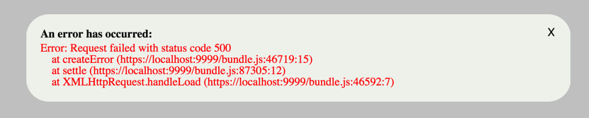

# react-error
*** This doc is still under construction and is incomplete ***

This is a very simple library designed to work with React and Redux to display a basic, highly customizable, message popup.



### Installation

This component can be installed using `npm`.

```
npm install --save react-error
```

### Documentaion

To make the component available, simply drop the component into a section of your application that is common throughout your application.  A common header or footer is usually a good place to drop the component:

```javascript
import Messages from 'react-error';
	:
	:
<Messages />
	:
	:
```

Connect the reducer to your state object as follows:

```javascript
import message from 'react-error/reducer';

const rootReducer = combineReducers({
	:	:	:
	:	// other state items
	:	:	:
	messages: message,
	:	:	:
	:	// other state items
	:	:	:
});
```

The component will display a popup when it receives specific properties in state.


The default css styling is:

```css
.message-backdrop
{
	position: absolute;
	top: 0;
	bottom: 0;
	left: 0;
	right: 0;
	background-color: grey;
	z-index: 4000;
	opacity: 0.5;
}

.message-container
{
	position: absolute;
	top: 50%;
	left: 50%;
	transform: translate(-50%, -50%);
	margin: auto;
	width: 45%;
/*	min-height: 20%;*/
	border: none;
	border-radius: 32px;
	background-color: #edf1ea;
	padding: 20px;
	opacity: 1;
	z-index: 4001;
}

.message-container button
{
	position: absolute;
	right: 15px;
	top: 15px;
	border-radius: none;
	border: none;
	background-color:inherit;
	font-size: 16px

}

.message-container div
{
	max-width: calc(100% - 25px);
}

.message-title-default
{
	margin-bottom: 4px;
	font-weight: 900;
}

.message-text-default
{
	white-space: pre;
}

.message-title
{
	color: black;
}

.message-text
{
	color: red;
}
```

Any of the css styling can be overriden by specifying `.react-error` before the style as follows:

```css
.react-error .message-backdrop
{
	background-color: blue;
}
```

further documentation coming soon.